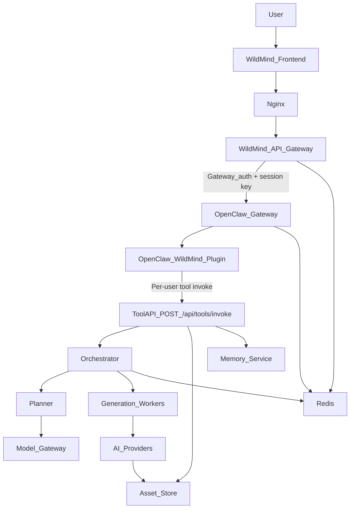
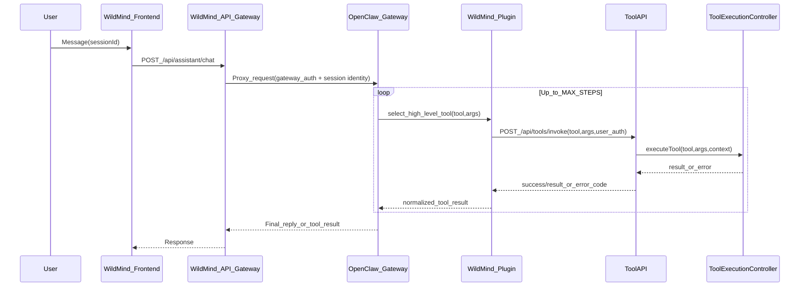
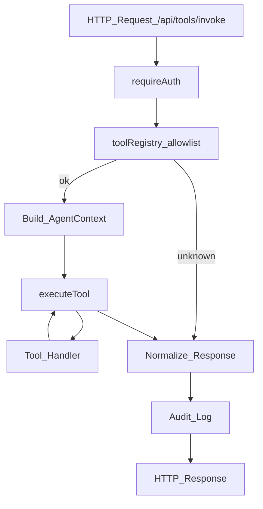

## WildMind ↔ OpenClaw Architecture

### Core execution rule

**OpenClaw = Brain. WildMind = Factory.**

- OpenClaw decides what to do next.
- WildMind executes the heavy workflow pipeline.
- Complex scene planning, provider fan-out, stitching, scoring, and export remain inside WildMind.
- OpenClaw should call high-level business tools, not provider-level internals.

### Goal

Integrate the **real OpenClaw Gateway** as a separate microservice that acts as the **agent runtime**:

- **OpenClaw decides WHAT** to do: reasoning, tool choice, session step loop
- **WildMind decides HOW** to do it: generation pipeline, assets, memory, workflows, billing/credits

OpenClaw runs on the same Lightsail instance, bound to localhost.

### System Architecture (single Lightsail instance)

### Session + state strategy

- OpenClaw owns **agent/runtime session continuity**.
- WildMind owns **business session state and memory**.
- WildMind derives **userId from auth token** (never from tool args).
- Use a stable OpenClaw session key derived from WildMind context such as `userId:sessionId`.
- WildMind state stores continue using compound keys:
  - `conversation:{userId}:{sessionId}`
  - `agent:state:{userId}:{sessionId}`

### Trust boundary

- Browser authenticates only to WildMind.
- WildMind API Gateway authenticates to OpenClaw using gateway auth.
- OpenClaw plugin calls WildMind Tool API using the original WildMind user auth.
- OpenClaw should not become the owner of WildMind business data, credits, or memory stores.

### Limits / loop safety

- **MAX_STEPS = 5**
- **MAX_TOOL_CALLS_PER_TURN = 10**

OpenClaw should enforce these in its agent loop. WildMind additionally rate-limits tool calls per user/tool.

### Agent runtime sequence

### Tool execution flow

### Edge cases and limits

- **Tool loops** — Prevent infinite retry loops with **MAX_STEPS = 5** and **MAX_TOOL_CALLS_PER_TURN = 10** plus OpenClaw-native `tools.loopDetection.enabled`. WildMind rate-limits tool calls per user per tool.
- **Tool failure** — WildMind returns a standardized shape: `{ success: false, error_code, error_message, retryable }`. OpenClaw should interpret `retryable: true` for transient errors (e.g. RATE_LIMITED, MODEL_TIMEOUT) and decide retry or abort; `retryable: false` for validation/unknown tool.
- **Multi-step reasoning** — OpenClaw keeps step memory and tool context; WildMind does not own the reasoning loop. Example: "Upscale my last image" -> OpenClaw calls `get_recent_generations` -> selects asset -> calls `upscale_image`.
- **Complex workflows** — Requests like "create a 60-second coffee ad" should map to high-level tools such as `generate_content` or `create_campaign`; WildMind internally decomposes scenes, clips, transitions, music, and export.
- **Long conversations** — Conversation history is stored in WildMind Redis (`conversation:{userId}:{sessionId}`). Use `GET /api/assistant/context?sessionId=...` for recent messages; optional summarization can be added later.
- **Cost control** — Token usage is tracked via `ai_usage_logs`; per-user quotas and credit balance are enforced at the gateway. OpenClaw-originated LLM calls should be tagged for attribution.
- **Latency** — OpenClaw runs on the same Lightsail instance as the API Gateway (localhost:18789); internal networking only. No public exposure of the OpenClaw port.
- **Session isolation** — Each request is scoped by `userId` (from token) and `sessionId` (in args). Redis keys include both; no cross-user access.

