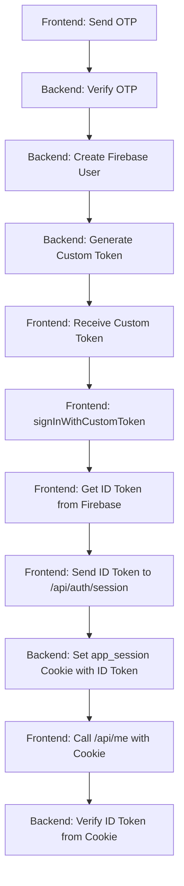

# 🔧 Token Fix - Convert Custom Token to ID Token

## **🔍 Problem Identified:**

The backend returns a **custom token** but the middleware expects an **ID token**.

- **Custom Token**: Used to authenticate with Firebase client SDK
- **ID Token**: Used for backend API authentication

## **✅ Solution: Frontend Token Conversion**

Update your frontend `handleVerifyOtp` function to convert the custom token to an ID token:

```typescript
// Add this import at the top
import { signInWithCustomToken } from 'firebase/auth'
import { auth } from './firebase' // Your firebase config

const handleVerifyOtp = async (e: FormEvent<HTMLFormElement>) => {
  e.preventDefault()
  setError("")
  setSuccess("")
  setProcessing(true)
  
  try {
    // Step 1: Backend creates Firebase user and returns custom token
    const response = await axios.post("http://localhost:5001/api/auth/email/verify", {
      email: email.trim(),
      code: otp.trim(),
      password: password
    }, {
      withCredentials: true
    })
    
    if (response.data?.data) {
      const { user, idToken: customToken } = response.data.data
      
      console.log("✅ Backend returned custom token!")
      console.log("🔑 Custom token received:", !!customToken)
      
      // Step 2: Convert custom token to ID token using Firebase client
      console.log("🔄 Converting custom token to ID token...")
      const userCredential = await signInWithCustomToken(auth, customToken)
      const idToken = await userCredential.user.getIdToken()
      
      console.log("✅ ID token obtained from Firebase client!")
      console.log("🔑 ID token length:", idToken.length)
      
      // Step 3: Create session with backend using ID token
      console.log("🔄 Creating session with ID token...")
      const sessionResponse = await axios.post('http://localhost:5001/api/auth/session', 
        { idToken: idToken }, // Use the ID token, not custom token
        { withCredentials: true }
      )
      
      if (sessionResponse.status === 200) {
        console.log("✅ Session created successfully!")
        console.log("🍪 Cookies:", document.cookie)
        
        // Test the /api/me endpoint immediately
        try {
          const meResponse = await axios.get('http://localhost:5001/api/me', {
            withCredentials: true
          })
          console.log("✅ /api/me test successful:", meResponse.data)
        } catch (meError) {
          console.error("❌ /api/me test failed:", meError)
        }
        
        localStorage.setItem("user", JSON.stringify(user))
        setShowUsernameForm(true)
        setOtp("")
        setOtpSent(false)
      } else {
        setError("Failed to create session")
      }
    }
  } catch (error: any) {
    console.error("❌ Error:", error)
    if (error.response?.data?.message) {
      setError(error.response.data.message)
    } else {
      setError("Authentication failed. Please try again.")
    }
  } finally {
    setProcessing(false)
  }
}
```

## **🔄 Complete Flow:**



## **📝 Required Import:**

Add this import to your component:

```typescript
import { signInWithCustomToken } from 'firebase/auth'
```

## **🧪 Expected Console Output:**

```
✅ Backend returned custom token!
🔑 Custom token received: true
🔄 Converting custom token to ID token...
✅ ID token obtained from Firebase client!
🔑 ID token length: 1200+ (much longer than custom token)
🔄 Creating session with ID token...
✅ Session created successfully!
🍪 Cookies: app_session=eyJhbGciOiJSUzI1NiIs...
✅ /api/me test successful: { user data }
```

## **🔍 Alternative Solution (Backend):**

If you prefer to handle this on the backend, I can modify the middleware to accept both custom tokens and ID tokens. Let me know if you want that approach instead.

## **🎯 Why This Works:**

1. **Backend generates custom token** (secure, server-side)
2. **Frontend exchanges for ID token** (Firebase client SDK)
3. **Backend middleware verifies ID token** (existing code works)
4. **No middleware changes needed** ✅

This maintains security while working with your existing authentication infrastructure!
