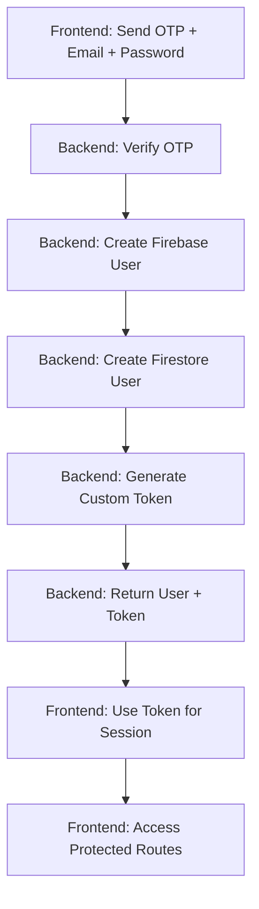

# 🔄 Updated Frontend Flow - No Duplicate User Creation

## **✅ Backend Changes Made:**

1. **Modified `/api/auth/email/verify` endpoint** to:
   - Create Firebase user (if doesn't exist)
   - Create Firestore user data
   - Generate Firebase custom token
   - Return both user data AND token

2. **Response now includes:**
```json
{
  "responseStatus": "success",
  "message": "OTP verified and user created",
  "data": {
    "user": { /* user data */ },
    "idToken": "eyJhbGciOiJSUzI1NiIs..." // Firebase custom token
  }
}
```

## **🔧 Frontend Changes Needed:**

Replace your `handleVerifyOtp` function with this **simplified version**:

```typescript
const handleVerifyOtp = async (e: FormEvent<HTMLFormElement>) => {
  e.preventDefault()
  console.log("🔍 Starting OTP verification process...")
  
  setError("")
  setSuccess("")
  setProcessing(true)
  
  try {
    const requestData = {
      email: email.trim(),
      code: otp.trim(),
      password: password
    }
    
    console.log("📤 Sending OTP verification to backend...")
    
    // Step 1: Verify OTP with backend (backend creates Firebase user and returns token)
    const response = await axios.post("http://localhost:5001/api/auth/email/verify", requestData, {
      withCredentials: true
    })
    
    console.log("📥 OTP verification response:", response.status)
    console.log("📥 Response data:", response.data)
    
    if (response.data && response.data.data) {
      const { user, idToken } = response.data.data
      
      console.log("✅ OTP verified and user created by backend!")
      console.log("🔑 Received ID token from backend:", idToken ? "YES" : "NO")
      console.log("👤 User data:", user)
      
      if (!idToken) {
        throw new Error("No ID token received from backend")
      }
      
      // Step 2: Create session with backend using the token from backend
      console.log("🔄 Creating session with backend...")
      const sessionResponse = await axios.post('http://localhost:5001/api/auth/session', 
        { idToken: idToken },
        { withCredentials: true }
      )
      
      console.log("📥 Session response status:", sessionResponse.status)
      
      if (sessionResponse.status === 200) {
        console.log("✅ Session created successfully!")
        console.log("🍪 Cookies after session:", document.cookie)
        
        // Store user data
        localStorage.setItem("user", JSON.stringify({
          email: email.trim(),
          uid: user.uid,
          ...user
        }))
        
        // Move to username form
        setShowUsernameForm(true)
        setOtp("")
        setOtpSent(false)
        setError("")
        
      } else {
        console.error("❌ Session creation failed:", sessionResponse.status)
        setError("Failed to create session. Please try again.")
      }
    }
    
  } catch (error: any) {
    console.error("❌ OTP verification error:", error)
    
    if (error.response?.data?.data && Array.isArray(error.response.data.data)) {
      const validationErrors = error.response.data.data
      const errorMessages = validationErrors.map((err: any) => err.msg).join(', ')
      setError(errorMessages)
    } else if (error.response?.data?.message) {
      setError(error.response.data.message)
    } else {
      setError("OTP verification failed. Please try again.")
    }
  } finally {
    setProcessing(false)
  }
}
```

## **🎯 Key Changes:**

### **❌ REMOVED (No longer needed):**
- Firebase imports (`createUserWithEmailAndPassword`, `signInWithEmailAndPassword`)
- Frontend Firebase user creation
- Frontend token generation
- Duplicate user creation logic

### **✅ SIMPLIFIED FLOW:**


## **🧪 Test the Fixed Flow:**

1. **Enter email, password, get OTP**
2. **Enter OTP and submit**
3. **Check console logs:**
   ```
   📤 Sending OTP verification to backend...
   ✅ OTP verified and user created by backend!
   🔑 Received ID token from backend: YES
   🔄 Creating session with backend...
   ✅ Session created successfully!
   🍪 Cookies after session: app_session=eyJ...
   ```

4. **No more Firebase errors** like `EMAIL_EXISTS` or `auth/operation-not-allowed`

## **🔍 What Backend Now Does:**

1. **Verifies OTP** ✅
2. **Creates Firebase user** (or updates existing) ✅
3. **Creates Firestore user data** ✅
4. **Generates Firebase custom token** ✅
5. **Returns everything to frontend** ✅

## **🔍 What Frontend Now Does:**

1. **Sends OTP verification** ✅
2. **Receives user + token from backend** ✅
3. **Creates session with received token** ✅
4. **No duplicate user creation** ✅

**This eliminates the duplicate user creation issue and simplifies your frontend code!** 🎉
